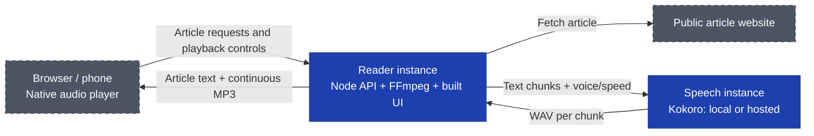

<h1 align="center">
Kokoro Article Reader
</h1>


Turn an online article into something you can listen to. Paste a link, choose a voice and speed, and start playback. The reader pulls out the article text and reads it aloud, with pause, resume and stop controls. You can also paste text directly.

<p align="center">
  
</p>

## Why it exists

The goal is hands-free listening to online articles. Being able to consume them while walking, cooking, at the gym, touching grass, or doing something other than looking at a screen. Existing operating system and phone read-aloud tools still make the journey from a web page to a comfortable and continuous listening more cumbersome than it should be. This project explores a simpler, dedicated reader built around that flow.

It's still an early version, not a finished podcast player. Narration now uses native continuous media, with lock-screen play/pause integration where the browser supports it and recovery of an existing recording after reload. Android/Brave testing confirmed prototype screen-off playback and integrated-reader recovery after Wi-Fi reconnection and browser kill/reopen. Browser processes can be reclaimed, and the saved position may lag while JavaScript is frozen. Speech generation runs in a separate service that you can host locally or remotely.

## Run it yourself

You'll need **Node 24**, **FFmpeg with libmp3lame**, and **Docker** for the local setup below. Run these commands from the project root. The first inference-image build downloads the model and its dependencies; the resulting speech service runs on CPU without runtime model downloads or an HF token.

### 1. Start the speech service

```sh
docker build -t article-reader-kokoro:local kokoro-service
docker run --rm --name article-reader-kokoro \
  -p 127.0.0.1:8000:8000 article-reader-kokoro:local
```

Leave this terminal running. In another terminal, check readiness:

```sh
curl --fail http://127.0.0.1:8000/health
```

Model loading takes time; retry the check until it succeeds before starting playback. Allow several GB of memory for inference; 4 GiB has proved tight in local tests, not a guaranteed sizing recommendation.

### 2. Start the reader

```sh
npm install --include=dev
npm run build
npm start
```

Open **http://127.0.0.1:3001**, paste a link and click **Read**. Narration starts automatically and the extracted article appears below. If extraction fails, choose **Paste text instead**.

The Listen card provides **Read again**, **Pause/Resume** and **Stop**. After stopping, use **Edit article text** to make changes; **Read again** generates fresh narration from that text without fetching the URL again. Voice/speed settings and playback diagnostics are collapsible. Reload recovery offers the same recording paused near its last saved position; tap Resume to continue without regenerating speech. English voices currently available: Heart, Bella and Nicole. Voice and synthesis speed are fixed for each listening session.

### Hosting

**Do not expose the app publicly as-is.** The reader requires an external access-control layer; it does not enforce per-user rate limits. Streaming admission is bounded to one generating narration and four retained recordings by default, but that is not a public-service abuse boundary. Keep it behind a VPN or another access-control layer, and keep local inference bound to loopback.

For containers, the root `Dockerfile` packages the reader UI and backend only; inference is a separate instance. The supplied `compose.yaml` targets a WireGuard deployment, binding to `10.0.0.1:8084` by default. See [deployment](docs/deployment.md) for image configuration, credentials, HTTPS, firewall and update instructions, or [HF inference](docs/hf-inference.md) to host the speech service on a Hugging Face Protected custom-container endpoint.

## Development and configuration

### Architecture



Grey, dashed components are external platforms outside our control; blue components are services we run.

The Node backend extracts article text with Mozilla Readability and owns narration: small paragraph/sentence chunks feed a single FFmpeg encoder producing continuous MP3 audio. The first chunk is capped at 220 characters, later chunks at 500. A native HTML audio element plays the growing stream before the full article is synthesized; foreground polling displays progress and handles recovery, not audio scheduling.

Browser API calls stay same-origin. Provider credentials remain on the reader backend, never in the browser. Article text, source metadata and recordings are retained temporarily on this reader instance for recovery; they do not survive a server restart. Browser storage contains only a validated session reference, title and best-known position, not article text or audio. With remote inference, text is sent to that service.

Pause pauses listening, not generation. The server continues within its generation and storage limits. Stop cancels future requests, kills the encoder, removes the recording and clears its bookmark, but cannot interrupt speech computation already running on the inference service. Recovery waits for a growing recording to complete before seeking; completed files support byte ranges.

### Development servers

With the speech service above running, start these in separate terminals:

```sh
npm run backend
npm run dev
```

Open **http://localhost:5173**. Vite serves the UI and proxies `/api` to the Node backend at `127.0.0.1:3001`. If you already have a Python 3.12 Kokoro environment, you can use it instead of Docker: from `kokoro-service`, run `.venv/bin/uvicorn app:app --host 127.0.0.1 --port 8000`.

### Backend configuration

Set these environment variables on the **Node backend**:

| Variable | Default | Purpose |
| --- | --- | --- |
| `TTS_URL` | `http://127.0.0.1:8000/tts` | Full speech-generation endpoint. |
| `TTS_TOKEN` | Unset | Optional server-side Bearer token. Never use a `VITE_*` variable for it. |
| `PORT` | `3001` | Reader backend port. |
| `HOST` | `127.0.0.1` | Reader backend bind address. |
| `STREAM_MAX_TEXT_CHARS` | `100000` | Narration text limit; extraction separately caps article text at 100,000 characters. |
| `STREAM_MAX_AUDIO_BYTES` | `64000000` | Encoded bytes per recording. |
| `STREAM_GENERATION_MS` | `1200000` | Twenty-minute synthesis/encoding deadline. |
| `STREAM_RETENTION_MS` | `21600000` | Six-hour retention after generation or a terminal error. |
| `STREAM_DISCONNECT_MS` | `120000` | Two-minute grace without audio consumers while generating; status polling does not extend it. |
| `STREAM_MAX_SESSIONS` | `4` | Retained session limit; inactive terminal sessions may be evicted for admission. |
| `STREAM_SPOOL_DIR` | Instance-specific temporary directory | Dedicated writable spool, exclusive to this server; set an owned bounded tmpfs in read-only containers. |

An external speech endpoint must accept `{text, voice, speed}` JSON and return a complete `audio/wav` response. HF's default Transformers runtime is not a drop-in replacement; use the separate Kokoro image described in [HF inference](docs/hf-inference.md). If you change the backend `PORT` during development, set `READER_BACKEND_PORT` to the same value when starting Vite.

### Tests

```sh
npm test
npm run build
```

Unit/integration tests cover extraction and SSRF protections, chunking, provider retries, native-player state and recovery, bounded streaming, concurrency, deadlines, retention, spool isolation, cancellation and shutdown. Encoder tests deliberately use synthetic WAV tones with real FFmpeg. For real browser playback tests, keep local Kokoro running, then run:

```sh
npx playwright install chromium
npm run test:browser
```

The browser suite starts dedicated servers on UI port 5197 and backend port 3017; override them with `READER_UI_PORT` and `READER_BACKEND_PORT`. Occupied ports fail rather than reuse another server. Traces and screenshots go to `.ui-review/playwright/`.

Tests require local Kokoro and internet access to `https://www.paulgraham.com/greatwork.html` for real article/audio checks. They cover native continuous MP3 playback, reload recovery without new synthesis, playback controls, completion, URL-first layout, extraction errors, manual fallback, editing/re-reading without re-extraction, keyboard access and responsive/reduced-motion behavior. Layout/startup/control fixtures are explicitly synthetic; real-provider tests separately exercise Kokoro and native MP3 playback. Headless checks don't establish narration quality or reliable background playback on physical phones.


## Locked-screen playback and diagnostic page

The default reader now uses the [continuous-media implementation](docs/streaming-spike.md). `npm run streaming` retains the diagnostic `/streaming.html` page with deliberate pacing, a lock-screen test mark and detailed reports, backed by the same API/provider. Screen-off playback was confirmed on Brave/Android in the prototype, with improved buffering when test pacing was disabled. Desktop tests recover an existing recording after reload and tab reopening without regeneration. Physical Android/Brave testing confirmed integrated-reader Resume after leaving/rejoining Wi-Fi and after killing/reopening the browser; integrated lock-screen controls have not been separately qualified.

## Current limits

- JS-heavy or paywalled pages may not extract; paste text as a fallback. Readability cannot remove every inline ad or consent banner.
- Extraction accepts public HTTP/HTTPS URLs on standard ports, without URL credentials. Private, loopback, link-local and reserved addresses are blocked, including redirects; DNS results are checked and the selected public IP is pinned to the connection.
- Fetches have a 15-second deadline, five-redirect limit and 3 MB HTML limit. Scripts are not executed, UTF-8 HTML is assumed, and article text is limited to 100,000 characters.
- Recovery seeks completed recordings and uses Media Session play/pause where supported, but arbitrary seeking in growing streams, offline narration and guaranteed unkillable mobile playback are not provided. Use one playback tab; cross-tab coordination is not implemented.
- The inference server needs to be dimensioned according to usage. Concurrent listening is limited by the speech service’s compute capacity and request queue. Although the model is shared per inference worker, not loaded separately for each user.
- Extended testing of local Kokoro CPU inference showed memory growth and an OOM kill at a 6 GiB container limit; this was not an observed failure of the HF endpoint. Restarting restored service, not a fix; see the [inference follow-up](docs/streaming-spike.md#known-inference-follow-up-sustained-cpu-memory-growth) before production use.

The old browser-inference experiment in `main_.js` is not loaded by the app. Its unused `kokoro-js` dependency was removed; revisiting it requires installing that dependency separately.
