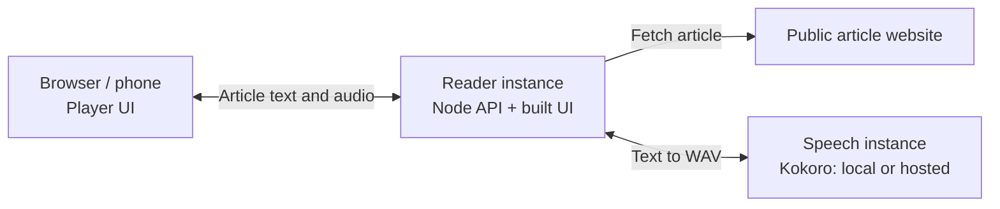

# Article Reader + Kokoro

Turn an online article into something you can listen to. Paste a link, choose a voice and speed, and start playback. The reader pulls out the article text and reads it aloud, with pause, resume and stop controls. You can also paste text directly.

## Why it exists

The goal is hands-free listening to online articles: catching up while walking, cooking or doing something other than looking at a screen. Built-in operating-system and phone read-aloud tools aren't there yet for this workflow—getting from a web page to comfortable, continuous listening still takes too much friction. This project explores a simpler, dedicated reader.

It's still an early version, not a finished podcast-style player. Keep the tab open: reliable mobile background playback and lock-screen controls are not implemented yet. A local-only, on-device model is also being considered; today, speech generation runs in a separate service, which you can host locally or remotely.

## Run it yourself

You'll need **Node 24** and **Docker** for the local setup below. Run these commands from the project root. The first inference-image build downloads the model and its dependencies; the resulting speech service runs on CPU without runtime model downloads or an HF token.

### 1. Start the speech service

```sh
docker build -t article-reader-kokoro:local kokoro-service
docker run --rm --name article-reader-kokoro \
  -p 127.0.0.1:8000:8000 article-reader-kokoro:local
```

Leave this terminal running. In another terminal, check readiness:

```sh
curl --fail http://127.0.0.1:8000/health
```

Model loading takes time; retry the check until it succeeds before starting playback. Allow several GB of memory for inference; 4 GiB has proved tight in local tests, not a guaranteed sizing recommendation.

### 2. Start the reader

```sh
npm install --include=dev
npm run build
npm start
```

Open **http://127.0.0.1:3001**, paste a link and click **Read article**. Narration starts automatically and the extracted article appears below. If extraction fails, choose **Paste text instead**.

The Listen card provides **Read again**, **Pause/Resume** and **Stop**. After stopping, use **Edit article text** to make changes; **Read again** generates fresh narration from that text without fetching the URL again. Voice/speed settings and buffer diagnostics are collapsible. English voices currently available: Heart, Bella and Nicole. Voice and synthesis speed are fixed for each listening session.

### Hosting and phone access

To use the reader from a phone, run it on a computer or server the phone can reach. Bind the app with `HOST=0.0.0.0 npm start` and use an **HTTPS reverse proxy** for access beyond your trusted network. The phone only needs a browser; it doesn't run the speech service.

**Do not expose the app publicly as-is.** The reader backend has no user authentication, rate limiting or concurrency admission control. Keep it behind a VPN or another access-control layer, and keep local inference bound to loopback.

For containers, the root `Dockerfile` packages the reader UI and backend only; inference is a separate instance. The supplied `compose.yaml` targets a WireGuard deployment, binding to `10.0.0.1:8084` by default. See [deployment](docs/deployment.md) for image configuration, credentials, HTTPS, firewall and update instructions, or [HF inference](docs/hf-inference.md) to host the speech service on a Hugging Face Protected custom-container endpoint.

## Development and configuration

### Architecture



The Node backend extracts article text with Mozilla Readability and proxies speech requests. The browser splits the text into paragraph/sentence chunks and buffers generated audio for continuous playback. The first chunk is capped at 220 characters, later chunks at 500; Web Audio schedules playback with a 45-second look-ahead target, which can overshoot by one chunk.

Browser API calls stay same-origin. Provider credentials remain on the reader backend, never in the browser. The app does not store URLs, article text or generated audio; with remote inference, text is sent to that service.

Pause freezes the audio clock and stops new synthesis requests; one in-flight request may finish. Stop aborts browser fetches and clears playback, but cannot interrupt speech computation already running on the service.

### Development servers

With the speech service above running, start these in separate terminals:

```sh
npm run backend
npm run dev
```

Open **http://localhost:5173**. Vite serves the UI and proxies `/api` to the Node backend at `127.0.0.1:3001`. If you already have a Python 3.12 Kokoro environment, you can use it instead of Docker: from `kokoro-service`, run `.venv/bin/uvicorn app:app --host 127.0.0.1 --port 8000`.

### Backend configuration

Set these environment variables on the **Node backend**:

| Variable | Default | Purpose |
| --- | --- | --- |
| `TTS_URL` | `http://127.0.0.1:8000/tts` | Full speech-generation endpoint. |
| `TTS_TOKEN` | Unset | Optional server-side Bearer token. Never use a `VITE_*` variable for it. |
| `PORT` | `3001` | Reader backend port. |
| `HOST` | `127.0.0.1` | Reader backend bind address. |

An external speech endpoint must accept `{text, voice, speed}` JSON and return a complete `audio/wav` response. HF's default Transformers runtime is not a drop-in replacement; use the separate Kokoro image described in [HF inference](docs/hf-inference.md). If you change the backend `PORT` during development, set `READER_BACKEND_PORT` to the same value when starting Vite.

### Tests

```sh
npm test
npm run build
```

Unit/integration tests cover extraction, SSRF and redirect protection, chunking, API behavior, buffering, pause, cancellation and cleanup. For real browser playback tests, keep local Kokoro running, then run:

```sh
npx playwright install chromium
npm run test:browser
```

The browser suite starts dedicated servers on UI port 5197 and backend port 3017; override them with `READER_UI_PORT` and `READER_BACKEND_PORT`. Occupied ports fail rather than reuse another server. Traces and screenshots go to `.ui-review/playwright/`.

Tests require local Kokoro and internet access to `https://www.paulgraham.com/greatwork.html` for real article/audio checks. They cover scheduling, playback controls, completion, URL-first layout, extraction errors, manual fallback, editing/re-reading without re-extraction, keyboard access and responsive/reduced-motion behavior. Some article/startup fixtures and the TTS error path are deliberately synthetic; playback checks retain real Kokoro audio. Headless checks don't establish narration quality or reliable background playback on physical phones.

### Independent UI preview

For a preview alongside other worktrees, build the UI and run `PORT=5187 HOST=127.0.0.1 npm start`. For hot reload, use separate terminals:

```sh
PORT=3017 npm run backend
READER_BACKEND_PORT=3017 npm run dev -- --host 127.0.0.1 --port 5187 --strictPort
```

Open **http://127.0.0.1:5187** with Kokoro running on port 8000. Stop the preview backend before browser tests, or choose a different test backend port. For worktree-local caches, create `.ui-review/tmp` and run `TMPDIR="$PWD/.ui-review/tmp" npm run test:browser`.

## Current limits

- JS-heavy or paywalled pages may not extract; paste text as a fallback. Readability cannot remove every inline ad or consent banner.
- Extraction accepts public HTTP/HTTPS URLs on standard ports, without URL credentials. Private, loopback, link-local and reserved addresses are blocked, including redirects; DNS results are checked and the selected public IP is pinned to the connection.
- Fetches have a 15-second deadline, five-redirect limit and 3 MB HTML limit. Scripts are not executed, UTF-8 HTML is assumed, and article text is limited to 100,000 characters.
- No seeking, saved articles, offline reader mode, media-session integration or guaranteed mobile background playback yet.

The old browser-inference experiment in `main_.js` is not loaded by the app. Its unused `kokoro-js` dependency was removed; revisiting it requires installing that dependency separately.
